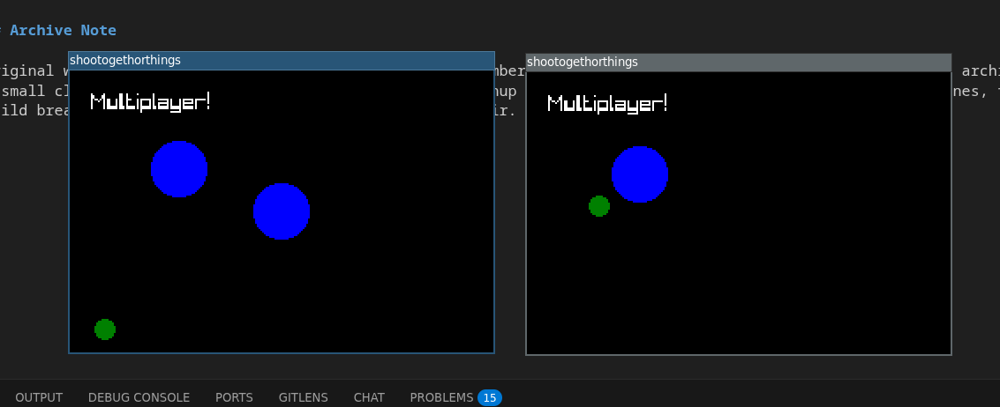

# shootogethorthings

An archived November 2023 Rust multiplayer prototype: a tiny `raylib` client, a `tokio` UDP server, simple ECS-driven players, and message passing experiments around synchronizing entities.

## Archive Note

Original work happened from November 9, 2023 through November 10, 2023. This repo is abandoned and kept as an archive of a small client/server networking experiment. A light cleanup pass on March 10, 2026 updated the dependency lines, fixed build breakage, and restored a compiling client/server pair.

## Notes

See [docs/networking-notes.md](/home/vega/Coding/GameDev/shootogethorthings/docs/networking-notes.md) for a short writeup on what the multiplayer model was trying to do, what is weak about it, and what a better high-latency co-op direction would look like.

## Screenshot

